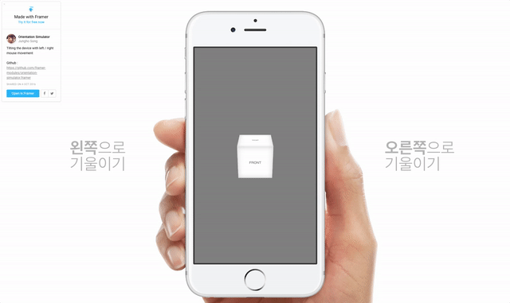

# Orientation simulator (for Desktop)
A Framer Studio module for deivce sensor simulator to your project. 

[Demo](http://share.framerjs.com/x1tqsgi1i7uo/)

<br/>

# Preview


<br/>

# Features
- Multiple browser supported
- Fullscreen supported
- Tilting the device with left / right mouse movement

<br/>

# Installation
Copy the "module" folder and paste it into your prototype folder
> More info about modules for Framer Studio: [FramerJS Docs - Modules](http://framerjs.com/docs/#modules.modules)

<br/>

# Usage
### OrientationSimulator

#### Method
##### OrientationSimulator.onTilt(gamma)
When the tilt value changes  

###### Parameters
* gamma [Double] - Y-axis rotation (default: 0, range: -1.0 ~ 1.0)

<br/>

# Sample
### Prepare
#### Set background color
```coffeescript
Screen.backgroundColor = "gray"
```

#### Create cube
```coffeescript
#
SIZE = 200
# Cube
cube = new Layer
    point: Align.center
    size: SIZE
    rotationY: 0, rotationX: -30
    style: 
        transformStyle: "preserve-3d"
        "-webkit-transform-style": "preserve-3d"
    backgroundColor: ""

# Face properties
properties = 
    size: SIZE
    style: 
        fontSize: "20px", fontWeight: "500", lineHeight: "#{SIZE}px"
        textAlign: "center", textTransform: "uppercase"
        boxShadow: "inset 0 0 30px rgba(0,0,0,0.2)"
    color: "rgba(0,0,0,.5)"
    backgroundColor: "rgba(255,255,255,1.1)"
    parent: cube
    
# Front
front = new Layer _.extend _.clone(properties), html: "front", z: 100
# Back
back = new Layer _.extend _.clone(properties), html: "back", z: -100, rotationY: 180
# Top
top = new Layer _.extend _.clone(properties), html: "top", rotationX: 90, y: -100
# Bottom
bottom = new Layer _.extend _.clone(properties), html: "bottom", rotationX: -90, y: 100
# Left
left = new Layer _.extend _.clone(properties), html: "left", rotationY: -90, x: -100
# RightSe
right = new Layer _.extend _.clone(properties), html: "right", rotationY: 90, x: 100
```

### Use module
```coffeescript
# Module
OrientationSimulator = require 'OrientationSimulator'
# Tilt
OrientationSimulator.onTilt (gamma) ->
    cube.rotationY = Utils.modulate gamma, [-1, 1], [-90, 90], false
```
